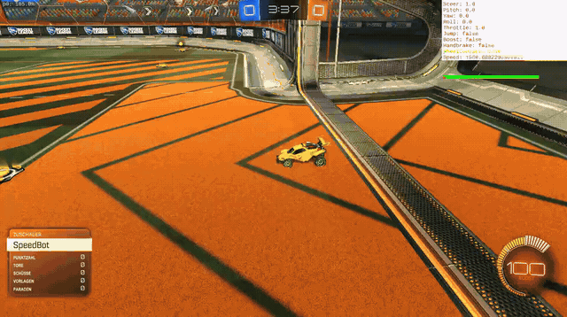
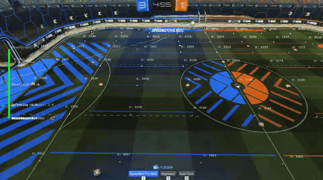
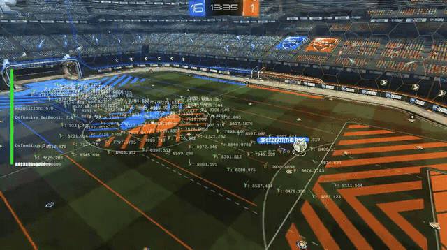
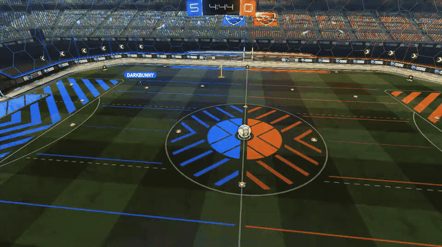
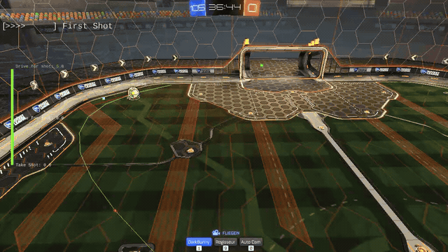
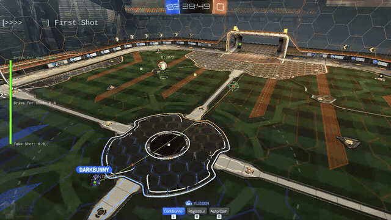
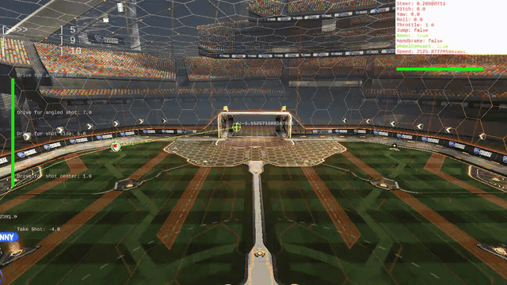

# Rocket League bot from the RLBOT Community

This was a fun Hobbyproject about the beginning of my studies in computer science.

Here are some historic gifs what the bot looked like and things it could do.

# Some Gifs

Preview of the chaining event System. It enabled smooth transitions between command sequences for reuse of simple actions like wavedashes etc.

This is an example how it can be used to produce a fast kickoff.

For better routes on the field i implemented a grid version of A* but thist urned out to be really weird so i stomped this idea for a dynamic hybrid where the grid is created on the fly.

This turned out to be a much better and faster alternative which also enabled me to dynamically react to things on the map like enemies and deactivated boost pads.

If you now think i am crazy you are right! Because i created the ultimate boost chaser bot with this technique. 

Another technique that can be implemented with this is stopping your enemy by locking them in to the rule.

Now this system can be combined with the ball physics to produce a trajectory to always hit a shot towards the goal.
|  | |
|-|-|
|||
| | |
|| |

And with all this in place you can just go ham and implement some more moves which can be chained to other moves like dribbling.

Here is some more things from that
